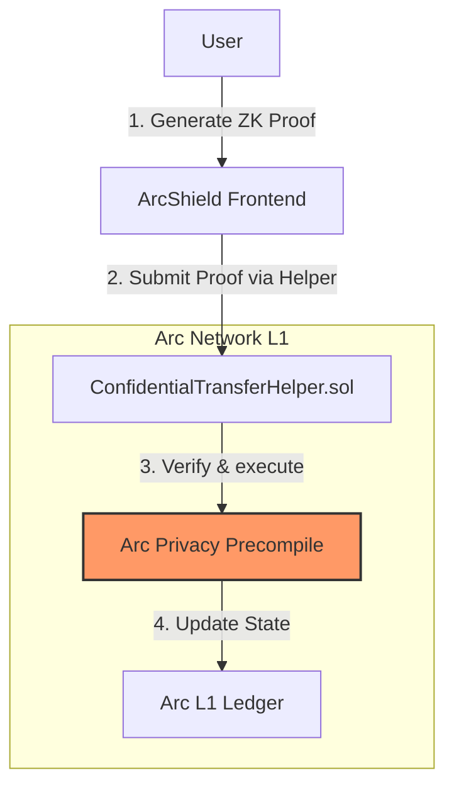

# ArcShield: Confidential Stablecoin Payments


**ArcShield** is a privacy-first payment DApp built on the **Arc Network**, utilizing Arc's native "Opt-in Privacy" features to enable confidential USDC transactions. Unlike traditional mixers, ArcShield leverages compliant, deterministic privacy technology native to the Arc L1.

## Why Arc?

We chose the **Arc Network** for three critical reasons:

1.  **Native Opt-in Privacy**: Arc provides a precompiled contract for ZK-proof verification directly at the protocol level. This offers superior gas efficiency and security compared to third-party smart contract mixers.
2.  **USDC as Gas**: Gas fees on Arc are paid in USDC. This abstracts away the complexity of holding a volatile native token (like ETH) just to pay for transactions, making the UX seamless for fintech applications.
3.  **Deterministic Finality**: Arc's consensus mechanism ensures instant transaction finality, which is crucial for payments where "reorgs" are unacceptable.

## Architecture



## Setup Instructions

### Prerequisites
- Node.js v18+
- Foundry (Forge)
- Git

### Installation

1. **Clone the repository**
   ```bash
   git clone https://github.com/your-org/arcshield.git
   cd arcshield
   ```

2. **Install Dependencies**
   ```bash
   npm install
   ```

3. **Contracts Setup**
   ```bash
   cd packages/contracts
   forge build
   ```

4. **Frontend Setup**
   ```bash
   cd packages/frontend
   npm run dev
   ```

## License
MIT
