# System Architecture

## Overview
ArcShield operates as a hybrid privacy system, leveraging on-chain storage for state (Merkle Tree) and off-chain computation for Zero-Knowledge Proof (ZKP) generation.

## 1. High-Level Architecture

```mermaid
graph TD
    User[User / Client]
    
    subgraph "Frontend Layer (Next.js)"
        UI[Privacy Form UI]
        Wallet[Wallet Connect]
        Prover[ZK Prover (WASM)]
    end
    
    subgraph "Blockchain Layer (Arc Network)"
        Helper[ConfidentialTransferHelper.sol]
        Precompile[Arc Privacy Precompile]
        USDC[USDC Contract]
        State[Private State Tree]
    end

    User -->|Input Amount & Recipient| UI
    UI -->|Sign Transaction| Wallet
    UI -->|Generate Proof| Prover
    Prover -->|Proof & Public Inputs| UI
    Wallet -->|Submit Tx| Helper
    Helper -->|Transfer Funds| USDC
    Helper -->|Verify Proof| Precompile
    Precompile -->|Update| State
```

## 2. Transaction Flow Sequence

```mermaid
sequenceDiagram
    participant U as User
    participant FE as Frontend
    participant W as Wallet
    participant C as Helper Contract
    participant P as Arc Precompile
    participant T as USDC Token

    U->>FE: Enter Amount & Recipient
    FE->>FE: Generate ZK Proof (WASM)
    FE->>W: Request Transaction Signature
    W->>U: Confirm Transaction
    U->>W: Sign & Send
    W->>C: confidentialTransfer(proof, root, nullifier, recipient, amount)
    
    rect rgb(20, 20, 20)
        Note right of C: On-Chain Validation
        C->>C: Check Balance & Inputs
        C->>T: transferFrom(user, helper, amount)
        C->>P: staticcall(proof, public_inputs)
        P-->>C: verified (bool)
        C->>C: Emit Event
    end
    
    C-->>W: Success
    W-->>FE: Tx Receipt
    FE-->>U: "Transfer Complete"
```



## 3. Core Components

| Component | Technology | Purpose |
|-----------|------------|---------|
| **Frontend** | Next.js 14, Tailwind | User interface for interacting with the protocol. |
| **Contracts** | Solidity 0.8.20 | Orchestrates fund movement and proof verification. |
| **Privacy** | ZK-SNARKs (Groth16) | Mathematical guarantee of transaction validity without revealing data. |
| **Infrastructure** | Arc Network | EVM-compatible L2 with native privacy precompiles. |
